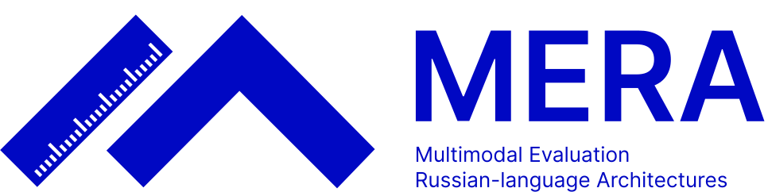

<p align="center">
    <picture>
        
    </picture>
</p>

<h2 align="center">
    <p> MERA (Multimodal Evaluation for Russian-language Architectures) открытый независимый бенчмарк для оценки современных генеративных моделей на русском языке.
    </p>
</h2>

<h2 align="center"> 🪩 МУЛЬТИМОДАЛЬНОСТЬ 🪩 </h2>

> ### **Проект MERA выходит за рамки текстовой модальности: мы готовим новые тесты для оценки больших мультимодальных моделей (с изображениями, аудио и видео).**

MERA — независимый открытый проект [Альянса в сфере ИИ](https://a-ai.ru/) на стыке академии и индустрии. Поучаствовать в нём может каждый, ведь для развития и оценки мультимодальных моделей нужны новые сложные тесты.
ИИ-сообщество активно изучает многообразие и особенности больших мультимодальных моделей (MLLMs), развивается методологическая основа для оценки таких моделей и выстраивания рейтингов.

**Мы предлагаем концепцию бенчмарка для мультимодальных моделей и первые задачи для тестирования.** Как и прежде, MERA открыта для сотрудничества с сообществом. Ниже вы найдете описания, как можно контрибьютить в проект. Присоединяйтесь к нам!🤗


### Концепция

Мультимодальный бенчмарк предполагает два режима тестов, аналогично текстовой MERA:

- **публичные / открытые тесты** — с открытой лицензией, сообщество может пользоваться тестами напрямую и сразу получать результат оценки (результаты не влияют на рейтинг моделей);
- **закрытые тесты** — с закрытым ответом и уникальными изображениями, которые нельзя найти в интернете (в рейтинге моделей учитываются только результаты закрытых задач; эти результаты можно получить исключительно через сабмит на сайте).

> **В бенчмаркинге остро стоит проблема утечки данных и data contamination. Поэтому для всех закрытых тестов мы используем созданные с нуля изображения, аудио и видео, которых нет в сети и, как следствие, не может быть в обучении моделей. Из тех же соображений результаты оценки на публичных задачах не включаются в расчет рейтинга моделей.**


#### На что мы ориентируемся при создании бенчмарка?

- разнообразие доменов;
- разнообразие изображений / аудио / видео;
- разнообразие сложности (от школьного уровня до экспертного);
- разнообразие тестируемых способностей MLLMs.

Наша команда разработала [**Таксономию способностей MLLMs**](docs/skills_tax.md) для решения задач с изображениями, аудио и видео. Во-первых, эта таксономия будет "дорожной картой" будущих задач мультимодальной MERA, которая будет определять, какие скиллы моделей покрыты бенчмарком, а для каких — нужно разрабатывать новые задачи. Для каждой задачи будет зафиксировано, какие навыки она тестирует. В перспективе с помощью карты мультимодальных навыков можно будет оценивать их относительную сложность как для MLLMs в целом, так и для отдельных моделей.

Все задачи хранятся в оригинальном формате MERA (см. [инструкцию по формату](docs/dataset_formatting.md)). Оценка моделей в актуальной кодовой базе поддерживается в режиме zero-shot. Система промптинга и количество shots в текущей реализации не фиксированы и могут быть изменены в дальнейшем. Предложения по улучшению, идеи, дискуссии и обратную связь мы приветствуем в issues текущего репозитория.


> ### 🔥 Первые Vision-to-Text тесты 🔥
> Датасеты, поддерживаемые актуальной кодовой базой:
> | Name | Task Name | Type | N-shots | Metrics |
> | --- | --- | --- | --- | ---  |
> | ruVQA | ruvqa | Public | 0 | EM |
> | ruCLEVR | ruclevr | Public  | 0 | EM |
> | WEIRD | weird | Public | 0 | EM |
>
> Список датасетов будет пополняться по мере их разработки, в том числе для других модальностей. 
>
> ### Датасеты доступны в [коллекции на 🤗HF Hub](https://huggingface.co/collections/MERA-evaluation/mera-multimodality-675859d796c41b994ae860b4).


### Оценка модели на MERA

#### Установка

0. Рекомендуемая версия Python `>=3.11.9`.

1. Склонируйте репозиторий [MERA-Evaluation/MERA_MULTIMODAL](https://github.com/MERA-Evaluation/MERA_MULTIMODAL):

    ```bash
    git clone --recurse-submodules https://github.com/MERA-Evaluation/MERA_MULTIMODAL.git
    ```

    Проверьте, что подтянулся подмодуль в папке lm-evaluation-harness. В этой папке должен находится репо с кодом харнесса. 
    Если по каким-то причинам подмодуль не подтянулся, склонируйте его отдельно:

    ```bash
    git submodule update --init --recursive
    ```

2. Установите lm-evaluation-harness. Для этого перейдите в папку с lm-evaluation-harness в репозитории и установите зависимости:
    ```bash
    cd MERA_MULTIMODAL/lm-evaluation-harness
    pip install -e .
    ```

    **Note:** Дополнительно может потребоваться остановка pillow или VLLM, если эти библиотеки используются в экспериментах.

    ```bash
    pip install pillow
    pip install -e ".[vllm]"
    ```


#### Прогон модели

Команды ниже выполняются из корневой папки репозитория.

Команда для прогона модели (ниже приведен пример для Qwen/Qwen2-VL-2B-Instruct):

```bash
CUDA_VISIBLE_DEVICES=0 lm_eval --model hf-multimodal \
--model_args pretrained=Qwen/Qwen2-VL-2B-Instruct,attn_implementation=flash_attention_2,dtype=bfloat16,convert_img_format=True \
--device cuda --output_path="$PWD/test" --batch_size=1 \
--log_samples --seed 1234 --num_fewshot=0 --apply_chat_template --fewshot_as_multiturn \
--include_path ./multimodal_tasks --tasks ruclevr,ruvqa,weird
```

Прогон модели с VLLM:

```bash
CUDA_VISIBLE_DEVICES=0 lm_eval --model vllm-vlm \
--model_args pretrained=Qwen/Qwen2-VL-7B-Instruct,dtype=bfloat16,convert_img_format=True,tensor_parallel_size=1,gpu_memory_utilization=0.5 \
--device cuda --output_path="$PWD/test" --batch_size=1 \
--log_samples --seed 1234 --num_fewshot=0 --apply_chat_template --fewshot_as_multiturn \
--include_path ./multimodal_tasks --tasks ruclevr,ruvqa,weird
```


### 🤝 MERA открыта для коллаборации и добавления новых датасетов! 🤝

Мы расширяем MERA на новые модальности (видео, аудио, картинки) и приглашаем сообщество участвовать в разработке новых сложных задач и обновлении кодовой базы проекта. В документации подробно описаны шаги и [система поощрения](docs/collab_bonus.md), которая позволит участникам **cтать частью проекта MERA и соавторами нашей будущей академической публикации (A\*/Q1)**.

Шаги для добавления новой задачи:

0) Разработать датасет (на стороне участника, см. [требования к задачам](docs/dataset_review.md))
1) Привести датасет в формат MERA ([инструкция](docs/dataset_formatting.md))
2) Загрузить датасет на 🤗HF Hub ([инструкция](docs/dataset_hf.md))
3) Отправить датасет на ревью организаторам MERA ([инструкция](docs/dataset_hf.md))
4) Написать код для оценки на основе lm-harness ([инструкция](docs/task_codebase.md))
5) Замерить, как справляется с задачей человек ([инструкция](docs/human_baseline.md)) 
6) Замерить актуальные baseline-модели на датасете
7) Финальная модерация — и ваш датасет официально добавлен!

Мы подготовили подробные инструкции, best practices, примеры и материалы:

- [Баллы для попадания в статью](docs/collab_bonus.md)
- [Критерии качества датасетов](docs/dataset_criteria.md)
- [Методология кросс-ревью](docs/dataset_review.md)
- [Формат датасетов MERA](docs/dataset_formatting.md)
- [Таксономия навыков MLLMs](docs/skills_tax.md)
- [Добавление новых датасетов на HF](docs/dataset_hf.md)
- [Добавление кодовой базы для новых датасетов](docs/task_codebase.md)
- [Как запустить оценку модели](docs/model_scoring.md)
- [Как провести Human Baseline](docs/human_baseline.md)


## Поощрение за коллаборацию

Организаторы предлагают [**систему оценки вклада**](docs/collab_bonus.md) в проект MERA:
- для контрибьюторов в кодовую базу (фичи, багфиксы);
- для авторов, разработавших новый датасет для MERA;
- за участие в написании академических статей;
- за проверку новых датасетов и код-ревью;
- за организационную работу.

По набранным баллам за коллаборацию участникам будет предложено соавторство в академической статье уровня A* / Q1 по мультимодальной части проекта MERA.


## Структура репозитория

- [`docs`](docs) — инструкции по добавлению новых датасетов в мера, по кодовой базе, человеческой оценке (Human Baseline) и др.
- [`multimodal_tasks`](multimodal_tasks) — задачи для оценки мультимодальных моделей.
- [`lm-evaluation-harness`](https://github.com/MERA-Evaluation/lm-evaluation-harness/tree/main) — фреймворк для оценки генеративных моделей, кодовая база для прогонов.
