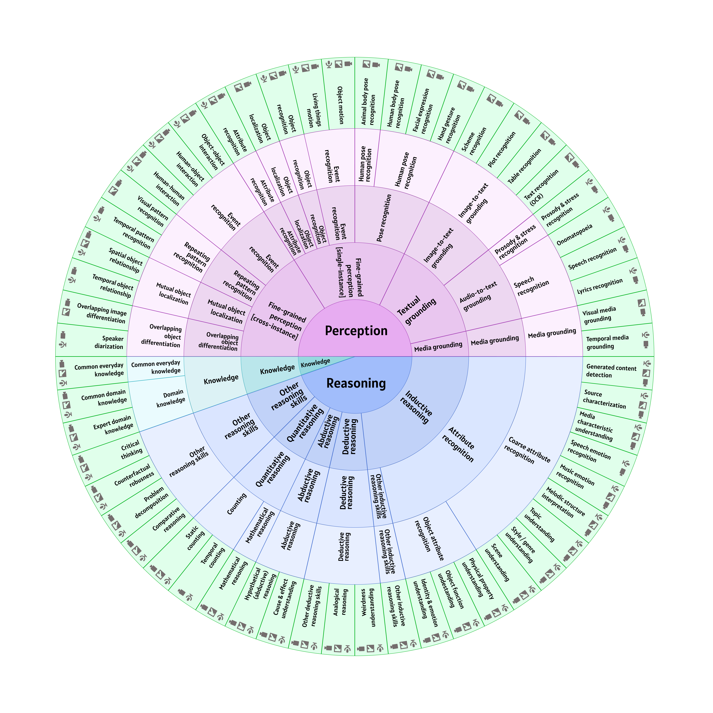

### Карта навыков MLLMs

MERA Multimodal предлагает **таксономию навыков** текстовых и мультимодальных моделей, которые тестирует бенчмарк, и которые появятся в нем по мере добавления новых задач. Для новых задач в приоритете оценивать навыки, которые ранее не были покрыты бенчмарком MERA.

<table>
    <thead>
        <tr>
            <th>L1</th>
            <th>L2</th>
            <th>L3</th>
            <th>L4</th>
            <th>Skills</th>
            <th>Modalities</th>
            <th>Datasets</th>
            <th></th>
        </tr>
    </thead>
    <tbody>
        <tr>
            <td rowspan="27">Perception</td>
            <td rowspan="9">Fine-grained cross-instance perception</td>
            <td rowspan="2">Overlapping object differentiation</td>
            <td rowspan="2">Overlapping object differentiation</td>
            <td><i>Overlapping image differentiation</i></td>
            <td>🖼️ 📽️</td>
            <td></td>
        </tr>
        <tr>
            <td><i>Speaker diarization</i></td>
            <td>🔊 📽️</td>
            <td></td>
        </tr>
        <tr>
            <td rowspan="2">Mutual object localization</td>
            <td rowspan="2">Mutual object localization</td>
            <td><i>Spatial object relationship</i></td>
            <td>🖼️ 🔊 📽️</td>
            <td><a href="../datasets/ruCLEVR/README_ru.md">ruCLEVR (🖼️)</a> <a href="../datasets/ruVQA/README_ru.md">ruVQA (🖼️)</a></td>
        </tr>
        <tr>
            <td><i>Temporal object relationship</i></td>
            <td>🔊 📽️</td>
            <td></td>
        </tr>
        <tr>
            <td rowspan="2">Repeating patter recognition</td>
            <td rowspan="2">Repeating patter recognition</td>
            <td><i>Visual pattern recognition</i></td>
            <td>🖼️ 📽️</td>
            <td></td>
        </tr>
        <tr>
            <td><i>Temporal pattern recognition</i></td>
            <td>🔊 📽️</td>
            <td></td>
        </tr>
        <tr>
            <td rowspan="3">Event recognition</td>
            <td rowspan="3">Event recognition</td>
            <td><i>Object-object interaction</i></td>
            <td>🖼️ 🔊 📽️</td>
            <td><a href="../datasets/ruVQA/README_ru.md">ruVQA (🖼️)</a></td>
        </tr>
        <tr>
            <td><i>Human-object interaction</i></td>
            <td>🖼️ 🔊 📽️</td>
            <td></td>
        </tr>
        <tr>
            <td><i>Human-human interaction</i></td>
            <td>🖼️ 🔊 📽️</td>
            <td></td>
        </tr>
        <tr>
            <td rowspan="8">Fine-grained single-instance perception</td>
            <td>Object localization</td>
            <td>Object localization</td>
            <td><i>Object localization</i></td>
            <td>🖼️ 📽️</td>
            <td><a href="../datasets/ruVQA/README_ru.md">ruVQA (🖼️)</a></td>
        </tr>
        <tr>
            <td>Object recognition</td>
            <td>Object recognition</td>
            <td><i>Object recognition</i></td>
            <td>🖼️ 🔊 📽️</td>
            <td><a href="../datasets/ruCLEVR/README_ru.md">ruCLEVR (🖼️)</a> <a href="../datasets/ruVQA/README_ru.md">ruVQA (🖼️)</a></td>
        </tr>
        <tr>
            <td rowspan="2">Event recognition</td>
            <td rowspan="2">Event recognition</td>
            <td><i>Object motion recognition</i></td>
            <td>🖼️ 🔊 📽️</td>
            <td></td>
        </tr>
        <tr>
            <td><i>Living things motion recognition</i></td>
            <td>🖼️ 🔊 📽️</td>
            <td></td>
        </tr>
        <tr>
            <td rowspan="4">Pose recognition</td>
            <td>Non-human pose recognition</td>
            <td><i>Animal body pose recognition</i></td>
            <td>🖼️ 📽️</td>
            <td></td>
        </tr>
        <tr>
            <td rowspan="3">Human pose recognition</td>
            <td><i>Human body pose recognition</i></td>
            <td>🖼️ 📽️</td>
            <td><a href="../datasets/ruVQA/README_ru.md">ruVQA (🖼️)</a></td>
        </tr>
        <tr>
            <td><i>Facial expression recognition</i></td>
            <td>🖼️ 📽️</td>
            <td></td>
        </tr>
        <tr>
            <td><i>Hand gesture recognition</i></td>
            <td>🖼️ 📽️</td>
            <td></td>
        </tr>
        <tr>
            <td rowspan="10">Textual grounding</td>
            <td rowspan="4">Image-to-text grounding</td>
            <td rowspan="4">Image-to-text grounding</td>
            <td><i>Scheme recognition</i></td>
            <td>🖼️ 📽️</td>
            <td></td>
        </tr>
        <tr>
            <td><i>Plot recognition</i></td>
            <td>🖼️ 📽️</td>
            <td></td>
        </tr>
        <tr>
            <td><i>Table recognition</i></td>
            <td>🖼️ 📽️</td>
            <td></td>
        </tr>
        <tr>
            <td><i>Text recognition (OCR)</i></td>
            <td>🖼️ 📽️</td>
            <td></td>
        </tr>
        <tr>
            <td rowspan="6">Audio-to-text grounding</td>
            <td>Prosody & stress recognition</td>
            <td><i>Prosody & stress recognition</i></td>
            <td>🔊 📽️</td>
            <td></td>
        </tr>
        <tr>
            <td rowspan="3">Speech recognition</td>
            <td><i>Onomatopoeia</i></td>
            <td>🔊 📽️</td>
            <td></td>
        </tr>
        <tr>
            <td><i>Speech recognition</i></td>
            <td>🔊 📽️</td>
            <td></td>
        </tr>
        <tr>
            <td><i>Song lyrics recognition</i></td>
            <td>🔊 📽️</td>
            <td></td>
        </tr>
        <tr>
            <td rowspan="2">Media grounding</td>
            <td><i>Visual media grounding</i></td>
            <td>🖼️ 📽️</td>
            <td></td>
        </tr>
        <tr>
            <td><i>Temporal media grounding</i></td>
            <td>🔊 📽️</td>
            <td></td>
        </tr>
        <tr>
            <td rowspan="3">Knowledge</td>
            <td rowspan="3">Knowledge</td>
            <td rowspan="3">Knowledge</td>
            <td>Common everyday knowledge</td>
            <td><i>Common everyday knowledge</i></td>
            <td>🖼️ 🔊 📽️</td>
            <td><a href="../datasets/ruCLEVR/README_ru.md">ruCLEVR (🖼️)</a> <a href="../datasets/ruVQA/README_ru.md">ruVQA (🖼️)</a> <a href="../datasets/WEIRD/README_ru.md">WEIRD (🖼️)</a></td>
        </tr>
        <tr>
            <td rowspan="2">Domain knowledge</td>
            <td><i>Common domain knowledge</i></td>
            <td>🖼️ 🔊 📽️</td>
            <td></td>
        </tr>
        <tr>
            <td><i>Expert domain knowledge</i></td>
            <td>🖼️ 🔊 📽️</td>
            <td></td>
        </tr>
        <tr>
            <td rowspan="25">Reasoning</td>
            <td rowspan="13">Inductive reasoning</td>
            <td rowspan="12">Attribute recognition</td>
            <td rowspan="9">Coarse attribute recognition</td>
            <td><i>Generated content detection</i></td>
            <td>🖼️ 🔊 📽️</td>
            <td></td>
        </tr>
        <tr>
            <td><i>Source characterization</i></td>
            <td>🖼️ 🔊 📽️</td>
            <td></td>
        </tr>
        <tr>
            <td><i>Media characteristic understanding</i></td>
            <td>🖼️ 🔊 📽️</td>
            <td></td>
        </tr>
        <tr>
            <td><i>Speech emotion recognition</i></td>
            <td>🔊 📽️</td>
            <td></td>
        </tr>
        <tr>
            <td><i>Music emotion recognition</i></td>
            <td>🖼️ 🔊 📽️</td>
            <td></td>
        </tr>
        <tr>
            <td><i>Melodic structure interpretation</i></td>
            <td>🖼️ 🔊 📽️</td>
            <td></td>
        </tr>
        <tr>
            <td><i>Topic understanding</i></td>
            <td>🖼️ 🔊 📽️</td>
            <td></td>
        </tr>
        <tr>
            <td><i>Style & genre understanding</i></td>
            <td>🖼️ 🔊 📽️</td>
            <td></td>
        </tr>
        <tr>
            <td><i>Scene understanding</i></td>
            <td>🖼️ 🔊 📽️</td>
            <td><a href="../datasets/ruVQA/README_ru.md">ruVQA (🖼️)</a></td>
        </tr>
        <tr>
            <td rowspan="3">Object attribute recognition</td>
            <td><i>Physical property understanding</i></td>
            <td>🖼️ 🔊 📽️</td>
            <td><a href="../datasets/ruCLEVR/README_ru.md">ruCLEVR (🖼️)</a> <a href="../datasets/ruVQA/README_ru.md">ruVQA (🖼️)</a> <a href="../datasets/WEIRD/README_ru.md">WEIRD (🖼️)</a></td>
        </tr>
        <tr>
            <td><i>Object function understanding</i></td>
            <td>🖼️ 🔊 📽️</td>
            <td><a href="../datasets/ruVQA/README_ru.md">ruVQA (🖼️)</a> <a href="../datasets/WEIRD/README_ru.md">WEIRD (🖼️)</a></td>
        </tr>
        <tr>
            <td><i>Identity & emotion understanding</i></td>
            <td>🖼️ 🔊 📽️</td>
            <td><a href="../datasets/ruVQA/README_ru.md">ruVQA (🖼️)</a> <a href="../datasets/WEIRD/README_ru.md">WEIRD (🖼️)</a></td>
        </tr>
        <tr>
            <td>Other inductive reasoning</td>
            <td>Other inductive reasoning</td>
            <td><i>Other inductive reasoning</i></td>
            <td>🖼️ 🔊 📽️</td>
            <td><a href="../datasets/WEIRD/README_ru.md">WEIRD (🖼️)</a></td>
        </tr>
        <tr>
            <td rowspan="3">Deductive reasoning</td>
            <td rowspan="3">Deductive reasoning</td>
            <td rowspan="3">Deductive reasoning</td>
            <td><i>Weirdness understanding</i></td>
            <td>🖼️ 🔊 📽️</td>
            <td><a href="../datasets/WEIRD/README_ru.md">WEIRD (🖼️)</a></td>
        </tr>
        <tr>
            <td><i>Analogical reasoning</i></td>
            <td>🖼️ 🔊 📽️</td>
            <td></td>
        </tr>
        <tr>
            <td><i>Other deductive reasoning</i></td>
            <td>🖼️ 🔊 📽️</td>
            <td></td>
        </tr>
        <tr>
            <td rowspan="2">Abductive reasoning</td>
            <td rowspan="2">Abductive reasoning</td>
            <td rowspan="2">Abductive reasoning</td>
            <td><i>Hypothetical reasoning</i></td>
            <td>🖼️ 🔊 📽️</td>
            <td></td>
        </tr>
        <tr>
            <td><i>Cause & effect understanding</i></td>
            <td>🖼️ 🔊 📽️</td>
            <td></td>
        </tr>
        <tr>
            <td rowspan="3">Quantitative reasoning</td>
            <td rowspan="3">Quantitative reasoning</td>
            <td rowspan="2">Counting</td>
            <td><i>Static counting</i></td>
            <td>🖼️ 🔊 📽️</td>
            <td><a href="../datasets/ruCLEVR/README_ru.md">ruCLEVR (🖼️)</a> <a href="../datasets/ruVQA/README_ru.md">ruVQA (🖼️)</a></td>
        </tr>
        <tr>
            <td><i>Temporal counting</i></td>
            <td>🔊 📽️</td>
            <td></td>
        </tr>
        <tr>
            <td>Mathematical reasoning</td>
            <td><i>Mathematical reasoning</i></td>
            <td>🖼️ 🔊 📽️</td>
            <td><a href="../datasets/ruVQA/README_ru.md">ruVQA (🖼️)</a></td>
        </tr>
        <tr>
            <td rowspan="4">Other reasoning</td>
            <td rowspan="4">Other reasoning</td>
            <td rowspan="4">Other reasoning</td>
            <td><i>Critical thinking</i></td>
            <td>🖼️ 🔊 📽️</td>
            <td></td>
        </tr>
        <tr>
            <td><i>Counterfactual robustness</i></td>
            <td>🖼️ 🔊 📽️</td>
            <td></td>
        </tr>
        <tr>
            <td><i>Problem decomposition</i></td>
            <td>🖼️ 🔊 📽️</td>
            <td></td>
        </tr>
        <tr>
            <td><i>Comparative reasoning</i></td>
            <td>🖼️ 🔊 📽️</td>
            <td><a href="../datasets/ruCLEVR/README_ru.md">ruCLEVR (🖼️)</a></td>
        </tr>
    </tbody>
</table>

